# About
- This folder contain all mini-project that i have done throughout University, including solidwork and inventor  
[Jump to Assembly](#assembly)
# Inventor
[Full folder](https://drive.google.com/drive/folders/1jKigr7kf7Mjp9l-MtQ3Z0OrxdryqVTVf?usp=sharing)
## Single part design
<table>
  <tr valign="top">
    <td><a href="https://drive.google.com/drive/folders/1ugprRzt7BidswMWkstKjqOUGjHQVA0aa?usp=drive_link">Drive</a> 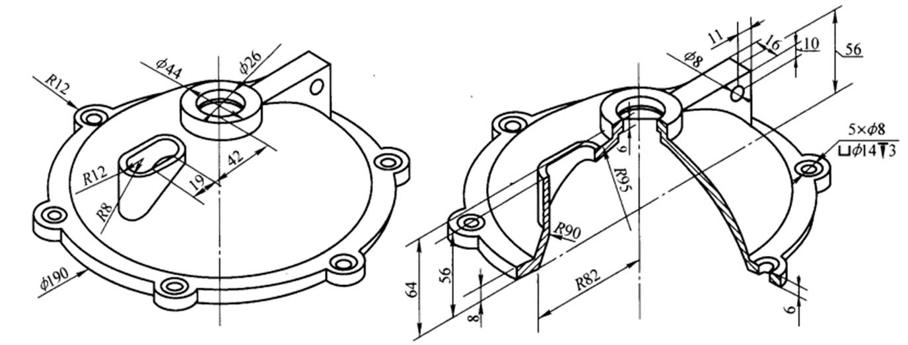</td>
    <td><a href="https://drive.google.com/drive/folders/17KyABaHdYQHCuJsSms3vHbcaGeuiXh3w?usp=drive_link">Drive</a> 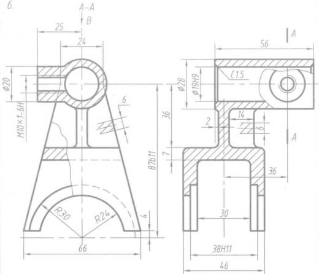</td>
    <td><a href="https://drive.google.com/drive/folders/1ADRSHNaOauB2YPCmdg__aMXWfi6CFPAp?usp=drive_link">Drive</a> 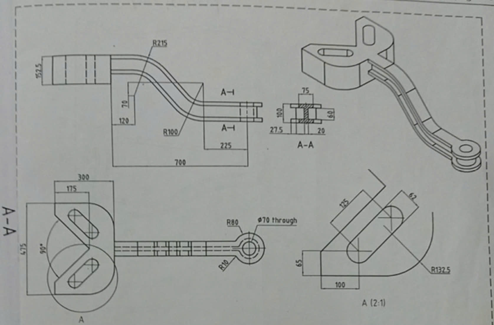</td>
  </tr>
  <tr valign="top">
    <td><a href="https://drive.google.com/drive/folders/1fH5rtJsJrstRGZHo7pwYGZdra9HDiq-3?usp=drive_link">Drive</a> 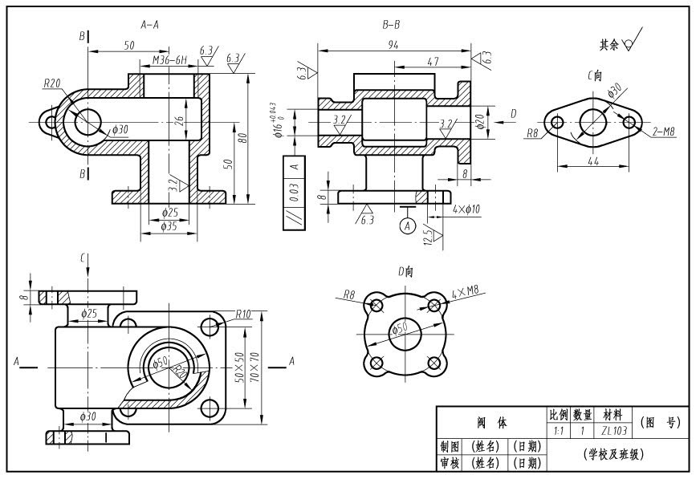</td>
    <td><a href="https://drive.google.com/drive/folders/1Laoqtr9CmHXwE1QdMlF3xtMHMX-HHLDJ?usp=drive_link">Drive</a> 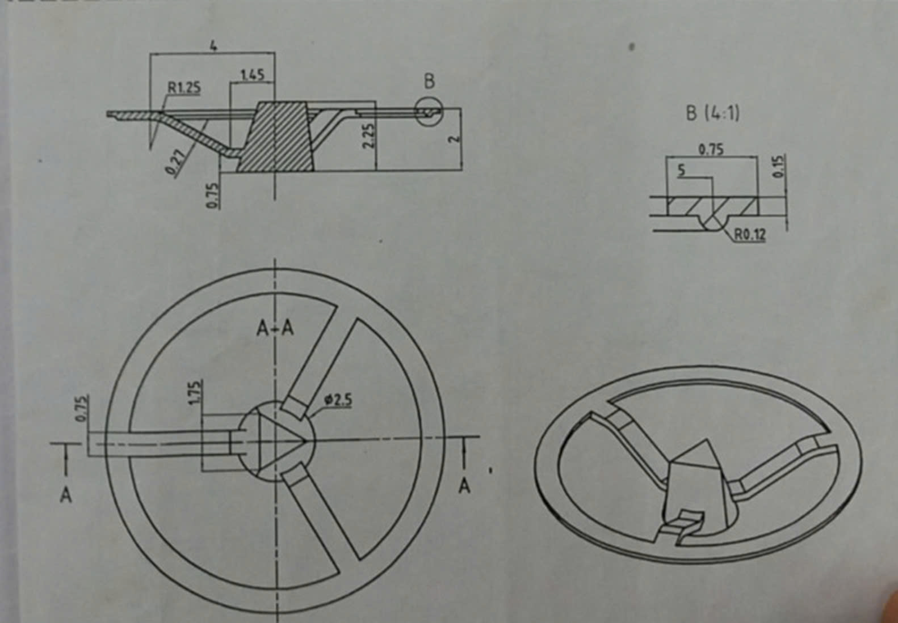</td>
    <td><a href="https://drive.google.com/drive/folders/10ikl0XqRuxdaaQCpdxhtYmY4KTGx8PP7?usp=drive_link">Drive</a> </td>
  </tr>
  <tr valign="top">
    <td><a href="https://drive.google.com/drive/folders/1A6ptSJstolpp7VKnlmOoErLsNZv_aGqo?usp=drive_link">Drive</a> 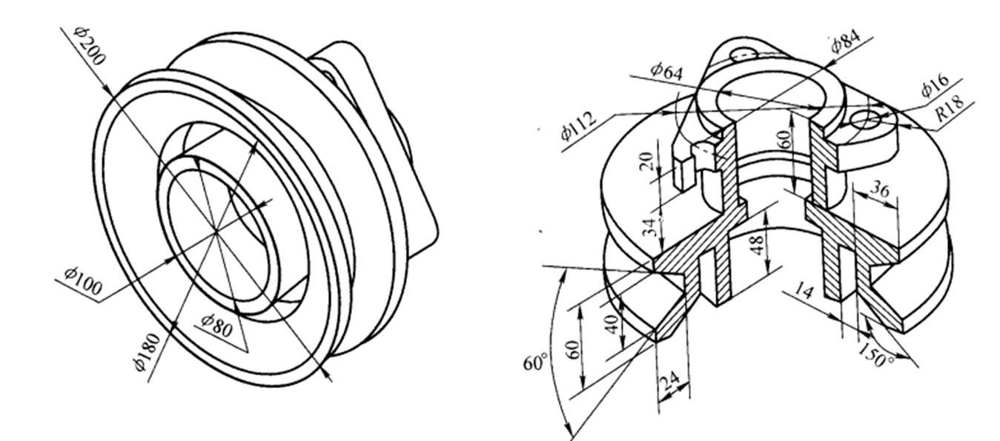</td>
    <td><a href="https://drive.google.com/drive/folders/1Q8AyBqgxy5agW1j0QUVwBZGmXrraPrhs?usp=drive_link">Drive</a> 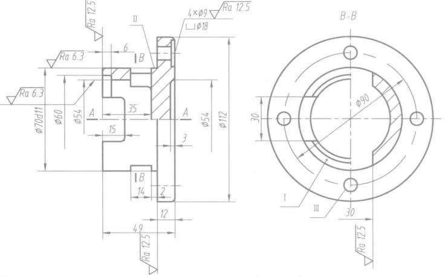</td>
    <td><a href="https://drive.google.com/drive/folders/14bx0Y152XcgUyUtVGAsUrUmWyG0Ag1C2?usp=drive_link">Drive</a> 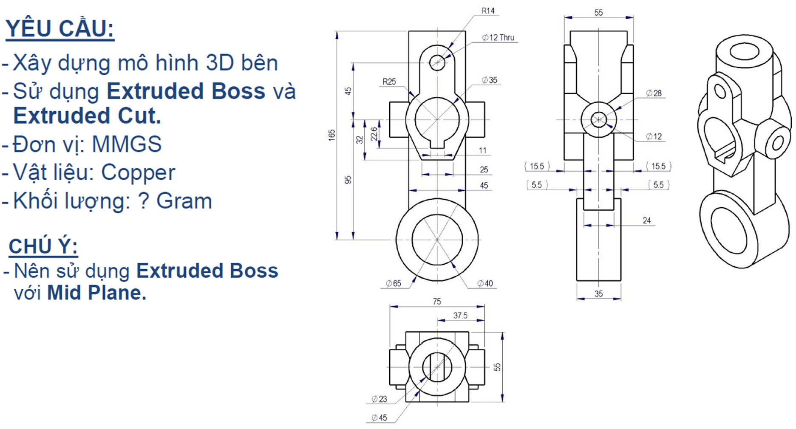</td>
  </tr>
  <tr valign="top">
    <td><a href="https://drive.google.com/drive/folders/1-hw50Q8pWyK2m1ez7sqbyt2Ni43y43jl?usp=sharing">Drive</a> </td>
    <td><a href="https://drive.google.com/drive/folders/1Q1enx4cowz7qnB58znex2sPzdnhJ37QX?usp=drive_link">Drive</a> 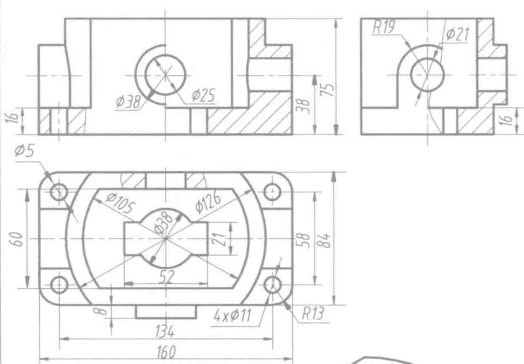</td>
    <td><a href="https://drive.google.com/drive/folders/1unQLlDpqY58UJQOB1ycpOYTMcfx_CeSo?usp=drive_link">Drive</a> 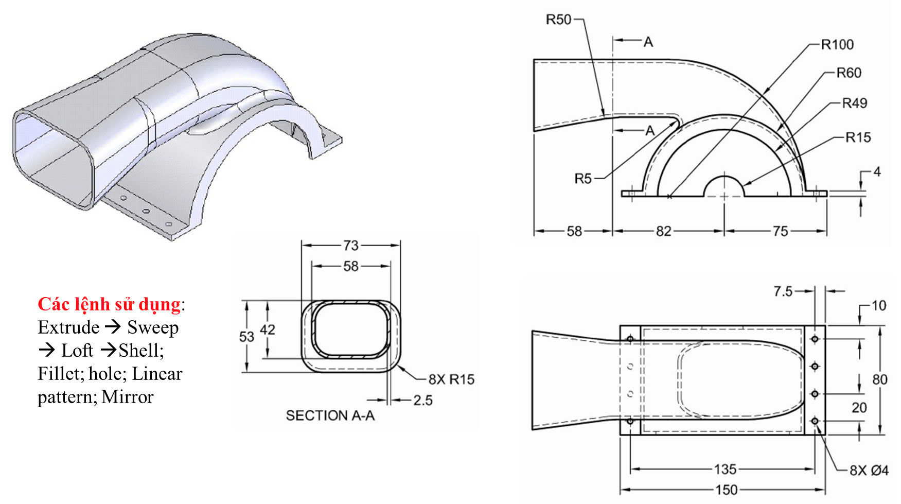</td>
  </tr>
  <tr valign="top">
    <td><a href="https://drive.google.com/drive/folders/106tAtISWlNAlPvld31LIlUSk0yn1dP6W?usp=drive_link">Drive</a> 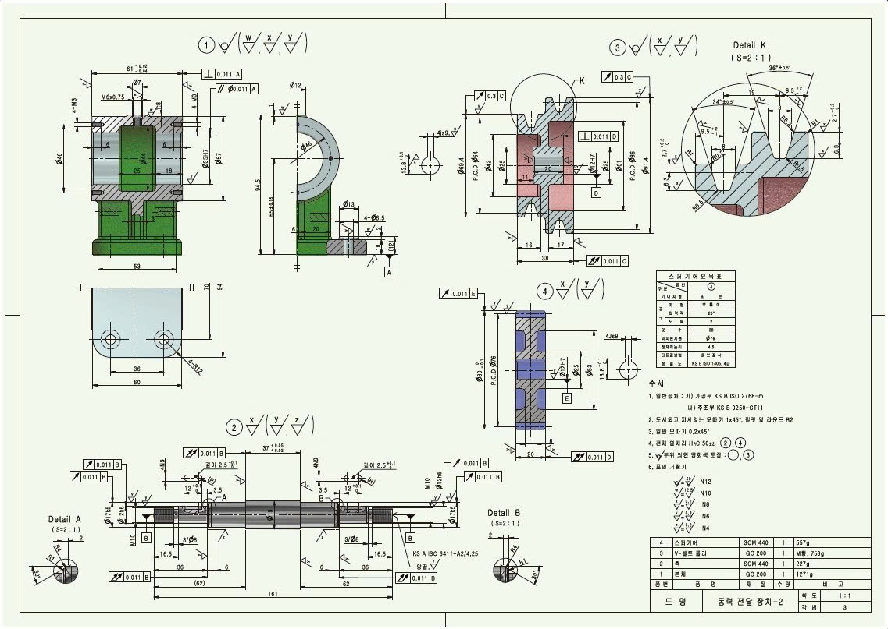</td>
    <td></td>
    <td></td>
  </tr>
</table>

## Assembly 
- [Full folder](https://drive.google.com/drive/folders/1DgYNdKQNP4mk9DMQmH2UvFJTw7SPdeV6?usp=drive_link)
### Clamp part design
- [Drive](https://drive.google.com/drive/folders/11e-QWCxVR2ZCaYG1c2zFvTnVMbFb8-NN?usp=drive_link)  

### 2 level bevel-gear box
- [Drive](https://drive.google.com/drive/folders/1ahaaU_polVM8gbmK6aduMNkPAA4hYnhJ?usp=drive_link) 
  
- It's a bit cramped in red lines and circles because my lecturer only give a pdf file and tell me to recreate a whole gear box, so i used [foxit reader](https://www.foxit.com/pdf-reader/) to measure and try to make 1:1 scale.
- Decomposed animation: [drive](https://drive.google.com/file/d/1uY1ag98vEUHNOqF6jrd7rkw60yk-St2c/view?usp=drive_link)

# Solidwork
- I have used solidwork to design a 4DoF parallel robot based on [ABB IRB 930T – 12/0.85](https://new.abb.com/products/robotics/robots/scara-robots/irb-930) -> [Drive](https://drive.google.com/drive/folders/1ZeXVYA546JylMyoD3On91UGOL4QAUuE2?usp=drive_link)
- Decomposed video: [drive](https://drive.google.com/file/d/1uEgJCzzeMudRUN11NjVR9VYm6qbpzCz1/view?usp=drive_link)
- Motion study video: [drive](https://drive.google.com/file/d/1kPTB6fDDdfT5rTaeSSei_RhzWEnDTGq8/view?usp=drive_link)
- Essay describe how i calculate and finalize chosing parts: [drive](https://drive.google.com/file/d/14B4WIiABpAgIqko5attVI1krpFqaoPbs/view?usp=drive_link)
  
  
