# Mechanical design projects

Every mini-project I built during my course, in Autodesk Inventor and SolidWorks.

| Inventor                                                                    | SolidWorks                         |
| --------------------------------------------------------------------------- | ---------------------------------- |
| [Single part designs](#single-part-design) &middot; [Assemblies](#assembly) | [4DoF parallel robot](#solidworks) |

## Inventor

### Single part design

<table>
  <tr valign="top">
    <td width="33.33%">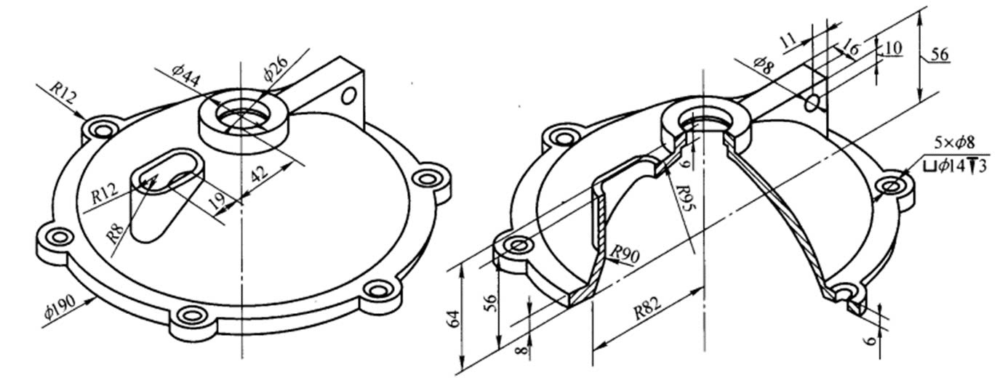</td>
    <td width="33.33%">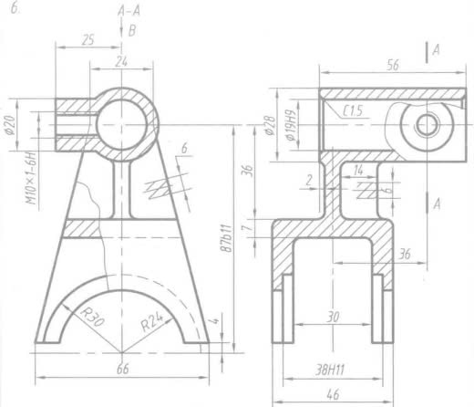</td>
    <td width="33.33%">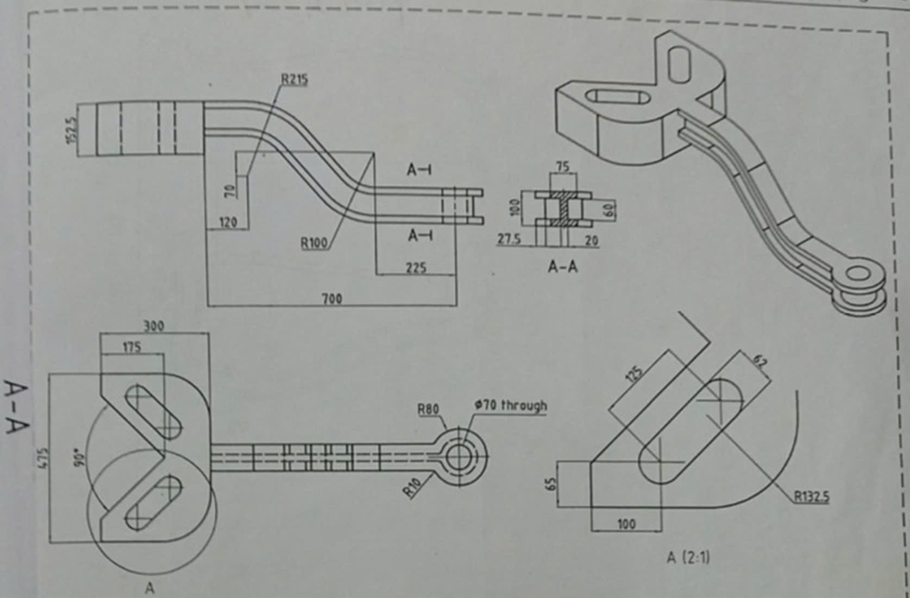</td>
  </tr>
  <tr valign="top">
    <td width="33.33%">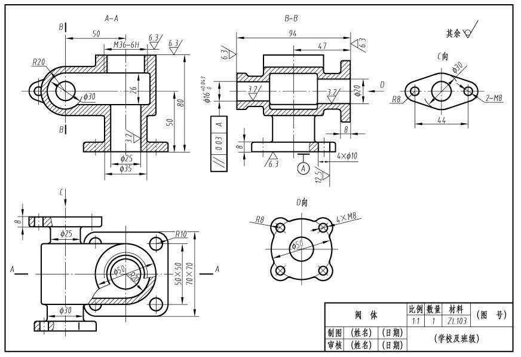</td>
    <td width="33.33%">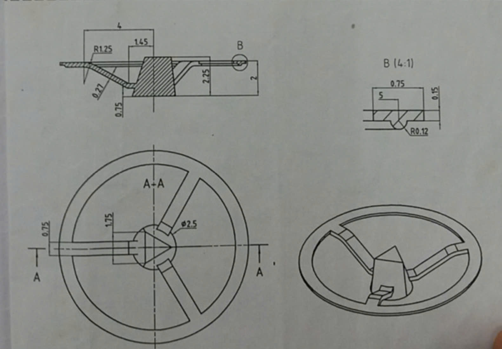</td>
    <td width="33.33%"></td>
  </tr>
  <tr valign="top">
    <td width="33.33%">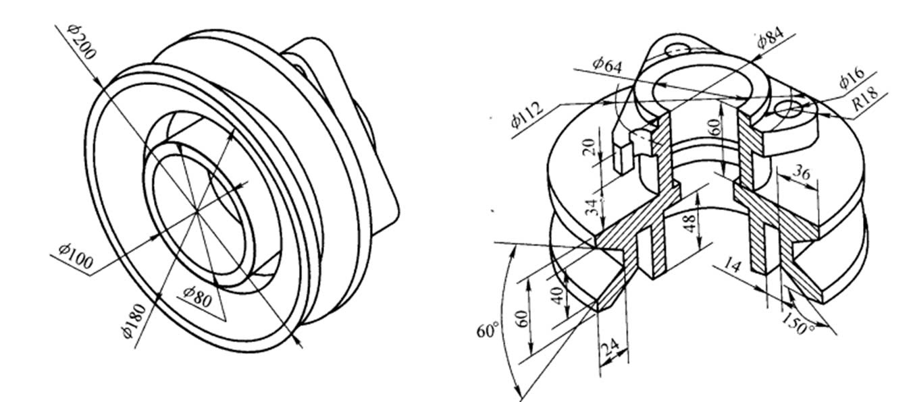</td>
    <td width="33.33%">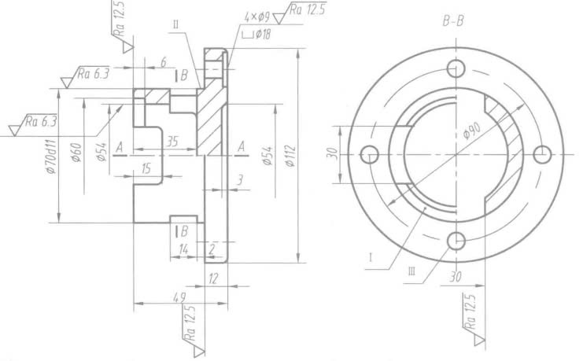</td>
    <td width="33.33%">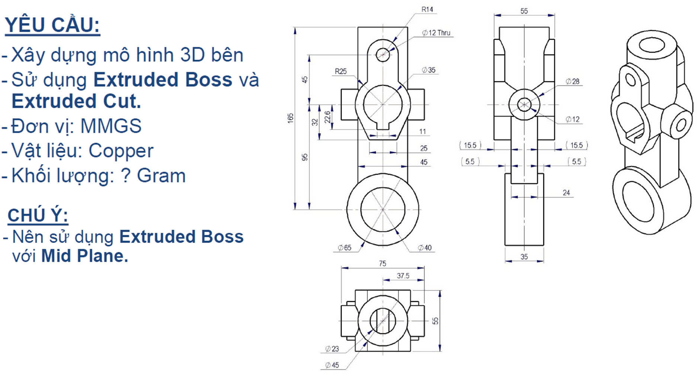</td>
  </tr>
  <tr valign="top">
    <td width="33.33%"></td>
    <td width="33.33%">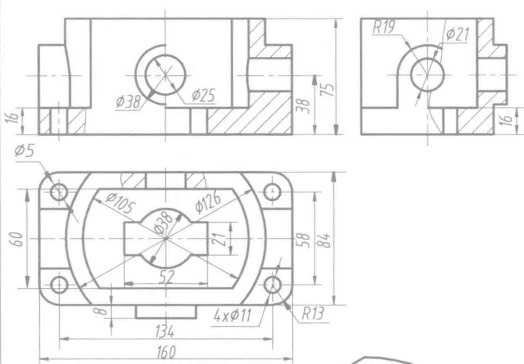</td>
    <td width="33.33%">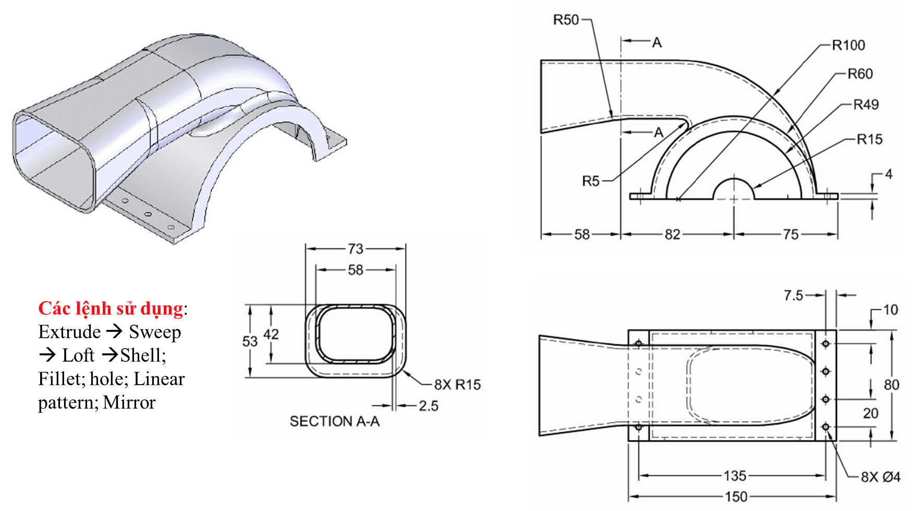</td>
  </tr>
  <tr valign="top">
    <td width="33.33%">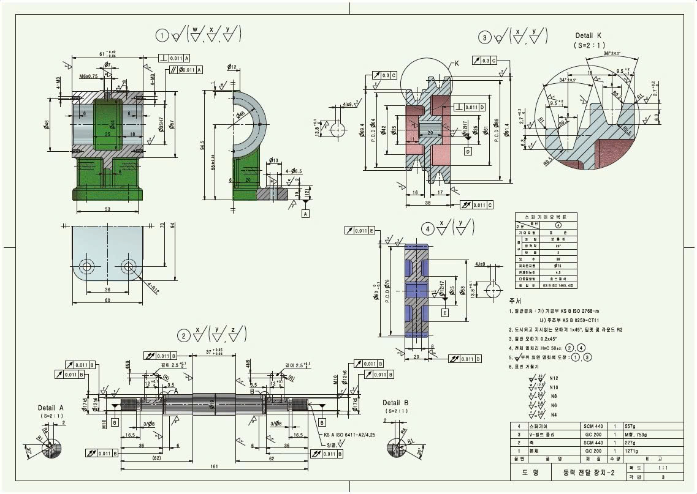</td>
    <td></td>
    <td></td>
  </tr>
</table>

### Assembly

#### Clamp part design

#### Bevel-gear box

The drawing is cramped around the red lines and circles because all I got was a PDF from my lecturer and a note to recreate the whole gearbox. I measured it in [Foxit Reader](https://www.foxit.com/pdf-reader/) and rebuilt it at 1:1 scale.

## SolidWorks

I used SolidWorks to design a 4DoF parallel robot based on the [ABB IRB 930T – 12/0.85](https://new.abb.com/products/robotics/robots/scara-robots/irb-930). The write-up goes through how I calculated and settled on the parts.

